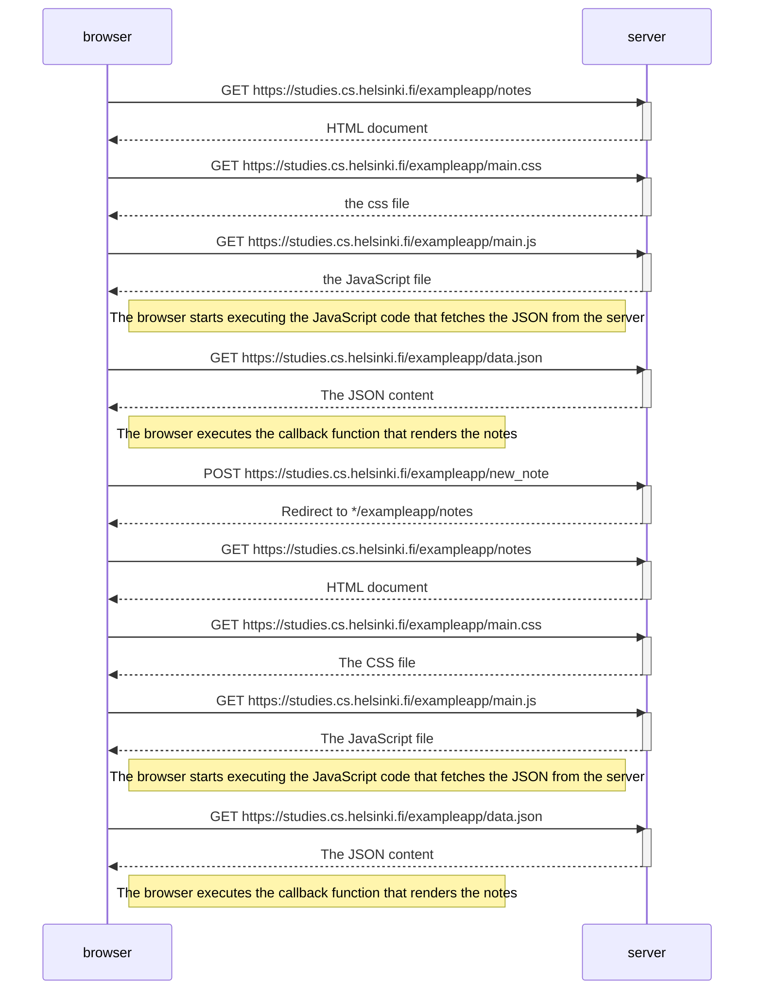

# Part 0 Exercise 4 - New Note Sequence Diagram

```mermaid
sequenceDiagram
    participant browser;
    participant server;

    browser->>server: GET https://studies.cs.helsinki.fi/exampleapp/notes;
    activate server;
    server-->>browser: HTML document;
    deactivate server;

    browser->>server: GET https://studies.cs.helsinki.fi/exampleapp/main.css;
    activate server;
    server-->>browser: the css file;
    deactivate server;

    browser->>server: GET https://studies.cs.helsinki.fi/exampleapp/main.js;
    activate server;
    server-->>browser: the JavaScript file;
    deactivate server;

    Note right of browser: The browser starts executing the JavaScript code that fetches the JSON from the server;

    browser->>server: GET https://studies.cs.helsinki.fi/exampleapp/data.json;
    activate server;
    server-->>browser: The JSON content;
    deactivate server;
    
    Note right of browser: The browser executes the callback function that renders the notes;
    
    browser->>server: POST https://studies.cs.helsinki.fi/exampleapp/new_note;
    activate server;
    server-->>browser: Redirect to */exampleapp/notes;
    deactivate server;

    browser->>server: GET https://studies.cs.helsinki.fi/exampleapp/notes;
    activate server;
    server-->>browser: HTML document
    deactivate server;

    browser->>server: GET https://studies.cs.helsinki.fi/exampleapp/main.css;
    activate server;
    server-->>browser: The CSS file
    deactivate server;

    browser->>server: GET https://studies.cs.helsinki.fi/exampleapp/main.js;
    activate server;
    server-->>browser: The JavaScript file;
    deactivate server;
    
    Note right of browser: The browser starts executing the JavaScript code that fetches the JSON from the server;
    
    browser->>server: GET https://studies.cs.helsinki.fi/exampleapp/data.json;
    activate server;
    server-->>browser: The JSON content;
    deactivate server;
    
    Note right of browser: The browser executes the callback function that renders the notes;
```
