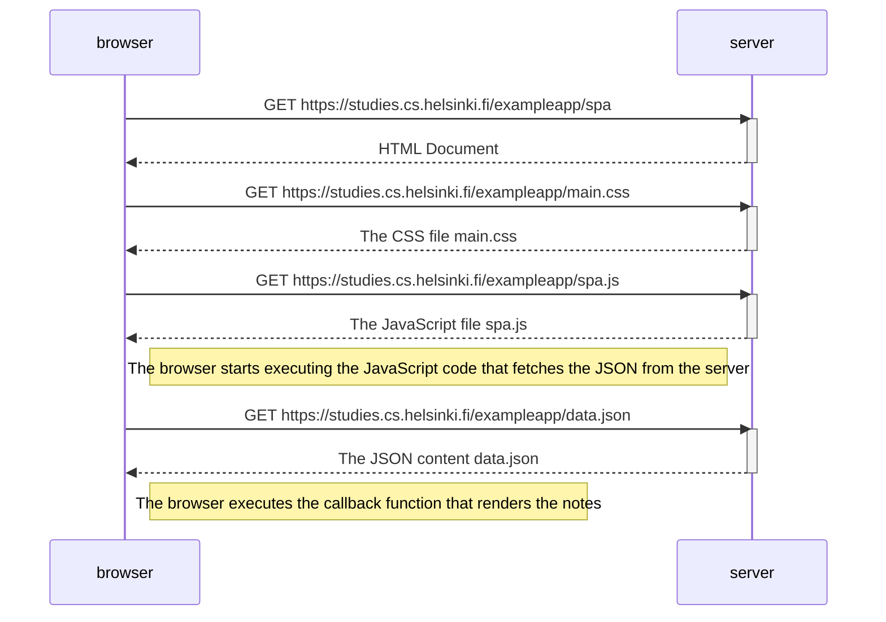

# Part 0 Exercise 5 - SPA Sequence Diagram

```mermaid
sequenceDiagram
    participant browser;
    participant server;

    browser->>server: GET https://studies.cs.helsinki.fi/exampleapp/spa;
    activate server;
    server-->>browser: HTML Document;
    deactivate server;

    browser->>server: GET https://studies.cs.helsinki.fi/exampleapp/main.css;
    activate server;
    server-->>browser: The CSS file main.css;
    deactivate server;

    browser->>server: GET https://studies.cs.helsinki.fi/exampleapp/spa.js;
    activate server;
    server-->>browser: The JavaScript file spa.js;
    deactivate server;

    Note right of browser: The browser starts executing the JavaScript code that fetches the JSON from the server;

    browser->>server: GET https://studies.cs.helsinki.fi/exampleapp/data.json;
    activate server;
    server-->>browser: The JSON content data.json;
    deactivate server;
    
    Note right of browser: The browser executes the callback function that renders the notes;
```
