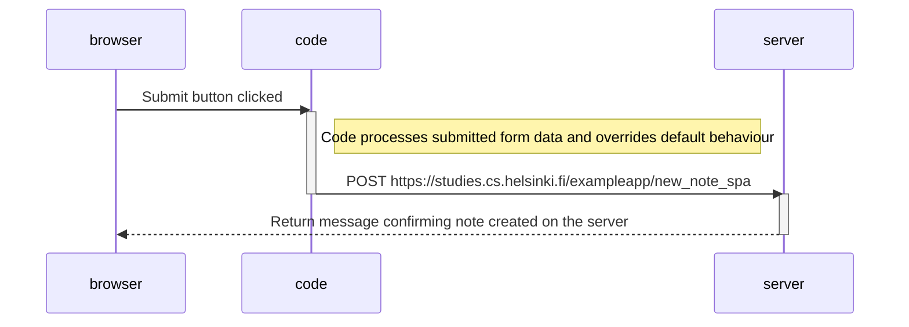

# Part 0 Exercise 6 - New Note in SPA Sequence Diagram

```mermaid
sequenceDiagram
    participant browser;
    participant code;
    participant server;

    browser->>code: Submit button clicked;
    activate code;
    note right of code: Code processes submitted form data and overrides default behaviour;
    code->>server: POST https://studies.cs.helsinki.fi/exampleapp/new_note_spa;
    deactivate code;
    activate server;
    server-->>browser: Return message confirming note created on the server;
    deactivate server;

```
